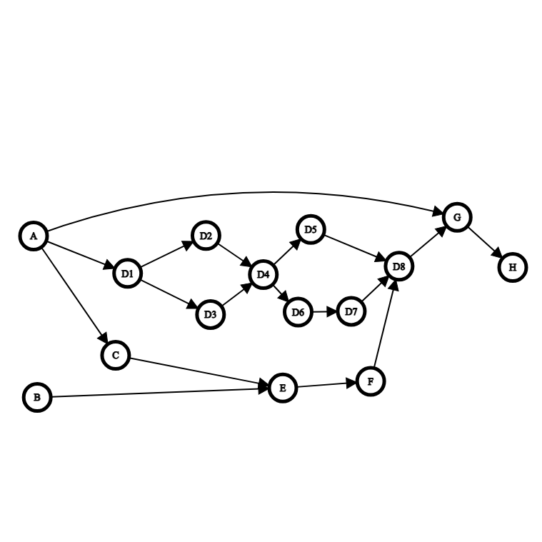

# MSDS 460 Assignment 1

This repository includes the work done for the second assignment of the MSDS 460 class. It tackles a project management problem using linear programming approach and PuLP library.

## Table of Contents
- [Introduction](#introduction-and-problem-setup)
- [Model Specification](#model-specification)
- [Programming](#programming)
- [Solution](#solution)
- [Overview](#overview)

## Introduction and Problem Setup

For this assignment, I have tackled the project management problem to create a team and accomplish the project of creating software for restaurant recommendations in Marlborough, Massachusetts. To accomplish this project, I have updated the excel sheet with the worst-case, expected and the best-case scenario time allocations for each task, as well as the required number of personnel needed for each task in the project. This allowed me to solve this problem using a linear programming approach. Some areas of uncertainty for this work are the task duration estimates, which are generated using PERT calculations, which are preliminary and do not take into account complexities of a real life problem. Another uncertainty would be based on the worker efficiency as well as the cost estimates, as these were simplified to make the solution easier to calculate. Following is a directed graph of the project:

Note that tasks A and B as well as D5 and D6 can be completed concurrently. 

The graph has been generated using the graph editor by [csacademy](https://csacademy.com/app/graph_editor/)

## Model Specification

For the project, I have decided to use a linear programming approach using PuLP library. As we are making the assumption that all the contributors charge the same hourly rate, I decided to tackle the problem by minimizing the completion time of the project. To accomplish this, I defined the decision variables as the start time and the completion time of each task, and the total finish time of the entire project. I ensured that each dependency had it’s predecessor complete before starting and determined the task with no successor to calculate the total time of the project. I have set the uniform hourly rate at $100/hour for total cost calculation purposes.

## Programming

The Python code for the problem setup and solution has been provided [here](Problem_Solution.py) with annotations for each section of the codes function. The program is written in Python using the PuLP library. The program includes logging function to report the output for the LP solution of each of the scenarios. The output log file can be found in the github repository under [project_schedule.log](project_schedule.log).

## Solution

We can look at the solution output of the code at [project_schedule.log](project_schedule.log). Following are the total time requirement to complete the project, the critical path for the project, the cost of the project and the worker requirements for each position for the project under each of the three scenarios:

### **Project Completion Time:**
Worst-case scenario: 780.0
Expected scenario: 520.0
Best-case scenario: 260.0

### **Critical Path:**
(Same for all 3 scenarios): A -> D1 -> D2 -> D4 -> D6 -> D7 -> D8 -> G -> H

### **Cost of Project:**
Worst-case scenario: $162600.0
Expected scenario: $108400.0
Best-case scenario: $54200.0

### **Worker Requirements:**
(Same for all 3 scenarios):
Project Manager: 2 concurrent workers
Front-end Developer: 1 concurrent worker
Back-end Developer: 2 concurrent workers
Data Engineer: 2 concurrent workers
Data Scientist: 1 concurrent worker

Looking at the results, we can see that the project completion time and the cost of project both follow a similar trend to our time allocations for each of the scenarios. This is because we haven’t taken into account the complexity of a real life project and calculated these time allocations mathematically, which preserved the trends between scenarios. We can see the results of this for both the critical path, where all three scenarios have the same critical path, as well as the worker requirements. One way to get different results and create a more realistic simulation would be to change the time allocations for each scenario more randomly for each task. This could introduce enough variation where we might end up with different worker requirements and maybe even critical paths.

## Overview

This work has tackled a project management problem using Pythons PuLP library to determine the optimal completion time for a software that recommends the consumers restaurants in the Marlborough, Massachusetts area. Based on this project outline, we expect to be able to deliver a prototype in about 13 weeks. This time is flexible and the project may be finished as early as 7 weeks and as late as 20 weeks. The project is estimated to cost the client about $130,080. This amount is commensurate with the project duration and accounts for 20% profit on the cost of the project. The project will handle the tasks outlined under [project-plan-v003.xlsx](project-plan-v003.xlsx), which also includes the estimated duration for each task and workforce needed to complete the task. Considering any potential uncertainty during the project, we have included worst-case and best-case scenario estimates, and may utilize Monte Carlo simulations to tackle these uncertainties in the future.